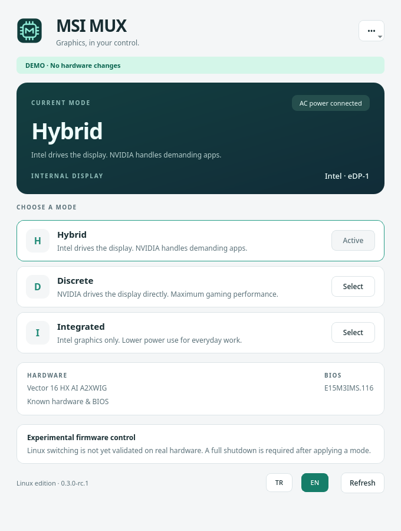

# MSI MUX for KDE

[Türkçe](README.tr.md) · [Releases](https://github.com/hayatboj/msi-gpu-mux-switch/releases) · [Recovery](docs/RECOVERY.md) · [Security](SECURITY.md)

A native Qt 6 tray application for controlling the GPU MUX on a supported MSI laptop. See the current graphics mode, right-click the KDE system tray icon to choose a mode, and switch between English and Turkish without restarting the application.



**Hardware validation status:** the original project's Windows switching path was characterized on the laptop below. Linux diagnostics work on this configuration. Live Linux firmware switching and recovery still require a documented hardware validation run. This fork must not be described as hardware-validated or universally compatible until that evidence exists. The current release is a release candidate.

| Supported configuration | Value |
|---|---|
| Model | MSI Vector 16 HX AI A2XWIG |
| Motherboard | MS-15M3 |
| BIOS | E15M3IMS.116 |
| Platform | Linux x86-64, UEFI boot |
| Desktop | KDE Plasma with a StatusNotifierItem system tray |

Other MSI laptops and BIOS versions are not enabled by the desktop application. Having an NVIDIA GPU, or a similarly named MSI model, is not sufficient.

## Features

- Current firmware mode and requested next mode shown separately.
- Hybrid, Discrete, and Integrated modes when advertised by the firmware.
- Actual GPU driving the internal panel.
- KDE tray menu, compact status window, English/Turkish UI, optional login startup.
- Polkit authorization through a narrowly scoped helper; the GUI never runs as root.
- Read-only polling without MSI ACPI calls or `nvidia-smi` GPU wakeups.
- Serialized firmware transactions and durable transaction metadata.
- Explicit confirmation and a pending shutdown state; no automatic reboot.

This changes the hardware graphics mode. PRIME render offload selects the GPU used by an application and is a different operation.

## Using the tray

Open **MSI MUX** from the application launcher. Right-click its tray icon to see the current mode and choose an available mode. Left-click to open the status window. The language menu switches between **English** and **Türkçe**. Startup at login is optional.

Switching requires AC power, matching hardware/BIOS, readable firmware state, and no unresolved previous transaction. After a successful request, the application displays a pending shutdown state; it does not pretend that the physical display connection has already changed.

Save your work before using the explicit shutdown action. After powering on, verify both the reported current mode and the internal display's GPU. On this laptop, Discrete mode disables display output through the Intel-wired Thunderbolt ports; HDMI is wired to NVIDIA.

## Install

Use the Linux archive and `SHA256SUMS` from [this fork's releases](https://github.com/hayatboj/msi-gpu-mux-switch/releases). Check the release's hardware validation notes. Extract the archive, then run from the extracted directory:

```sh
python3 install.py --check
sudo python3 install.py
```

Remove the archive installation with its `uninstall.py`. Do not install both the archive bundle and Arch package at the same time. Installation does not enable login startup automatically.

The archive targets Linux x86-64 and requires Qt 6 and Polkit. Distribution-native building is preferred when the release binary's runtime requirements do not match your distribution.

## Build

Development dependencies: Rust 1.88+, CMake, a C++20 compiler, Python 3, and Qt 6 Core, Gui, Widgets, Network, DBus, Svg, and Test. On Arch/CachyOS these are provided by `base-devel`, `cmake`, `ninja`, `rust`, `python`, `qt6-base`, and `qt6-svg`; runtime authorization uses `polkit` and a desktop authentication agent.

```sh
./scripts/build-linux.sh
./scripts/package-linux.sh 0.3.0-rc.1
```

Arch packaging is in [`packaging/`](packaging/). The running kernel needs the MSI WMI platform driver for detailed diagnostics and mode changes.

| Installed path | Purpose |
|---|---|
| `/usr/bin/msi-mux-tray` | Unprivileged desktop application |
| `/usr/bin/msi-mux-switch` | Rust backend |
| `/usr/lib/msi-mux/msi-mux-helper` | Restricted privileged helper |
| `/usr/share/polkit-1/actions/org.hayatboj.msimux.policy` | Authentication policy |
| `/var/lib/msi-mux/` | Root-controlled transaction metadata |

The helper accepts only supported mode names and diagnostics. It does not accept a program path, shell command, arbitrary firmware value, or hardware override from the GUI.

## Read-only diagnostics

Routine status does not invoke ACPI:

```sh
msi-mux-switch --status --json
```

Detailed diagnostics additionally query MSI WMI when permission is available:

```sh
msi-mux-switch --debug --json
```

A successful diagnostic is not proof that physical switching or recovery has succeeded.

## Development

Read [CONTRIBUTING.md](CONTRIBUTING.md), [AGENTS.md](AGENTS.md), and the [validation record](docs/VALIDATION.md). CI tests synthetic firmware failures, GUI parsing and gating, localization, helper restrictions, and installation boundaries. It also builds the preserved Windows CLI.

Never run a real firmware write as a unit test, installation check, screenshot step, or CI action. Hardware validation is a separate operation followed by complete shutdown and post-boot verification.

## Limits

The tool writes an OEM UEFI variable and invokes MSI ACPI methods. Failure after a trigger can leave the hardware outcome uncertain. Returning previous target bits does not reverse every hardware action. BIOS defaults or an EC reset are not guaranteed recovery. Read [the recovery notes](docs/RECOVERY.md) before a first hardware trial.

## Upstream and license

Forked from [steelbrain/msi-gpu-mux-switch](https://github.com/steelbrain/msi-gpu-mux-switch). Original copyright notices and Windows protocol work are retained. This fork adds the KDE application, Linux integration, packaging, and transaction hardening. [MIT license](LICENSE). Independent project; not affiliated with MSI or NVIDIA.
