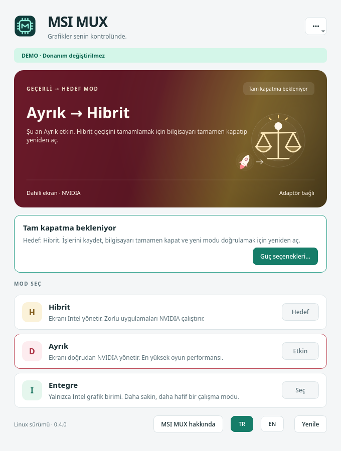

# KDE için MSI MUX

[English](README.md) · [Sürümler](https://github.com/hayatboj/msi-gpu-mux-switch/releases) · [Kurtarma bilgileri](docs/RECOVERY.md)

Desteklenen MSI dizüstünde fiziksel GPU MUX modunu KDE sistem tepsisinden yöneten, Qt 6 ile geliştirilmiş masaüstü uygulaması. Geçerli modu görün, simgeye sağ tıklayarak başka bir mod seçin ve uygulamayı kapatmadan Türkçe/İngilizce arasında geçin.



**Donanım doğrulama durumu:** Aşağıdaki yapılandırmada, kurulu **0.3.0-rc.1** sürümüyle Linux üzerinde gerçek **Hibrit → Ayrık** geçişi 7 Eylül 2026’da başarılı oldu. Kullanıcı bilgisayarı elle tamamen kapatıp yeniden açtıktan sonra firmware Ayrık mod bildirdi ve aktif dahili eDP panelinin doğrudan NVIDIA tarafından sürüldüğü doğrulandı. Bu sonuç yalnız bu yapılandırmadaki bir geçişi doğrular; Hibrit’e geri dönüş, Entegre mod ve hata sonrası kurtarma henüz doğrulanmadı. Yazılım **sürüm adayı** olarak kalıyor. [Test adımları ve kullanılan uygulama commit’i](docs/VALIDATION.md#live-linux-hardware-observation) doğrulama kaydında bulunuyor.

| Desteklenen yapılandırma | Değer |
|---|---|
| Model | MSI Vector 16 HX AI A2XWIG |
| Anakart | MS-15M3 |
| BIOS | E15M3IMS.116 |
| Sistem | Linux x86-64, UEFI |
| Masaüstü | KDE Plasma sistem tepsisi |

## Kullanım

Uygulama menüsünden **MSI MUX**’u açın. Sağ alttaki simgeye sağ tıklayarak geçerli modu ve kullanılabilir seçenekleri görün:

- **Hibrit:** Intel ve NVIDIA birlikte kullanılabilir.
- **Ayrık:** Ayrık ekran kartını seçer; bu cihazda NVIDIA.
- **Entegre:** İşlemcinin dahili grafik birimini seçer; bu cihazda Intel.

Sol tıklamak durum penceresini açar. Geçerli mod, hedef mod ve dahili ekranı süren GPU ayrı gösterilir. Hedefin seçilmiş olması, ekran bağlantısının henüz değiştiği anlamına gelmez.

Dil menüsünden **Türkçe** veya **English** seçilebilir. Oturum açıldığında başlatma isteğe bağlıdır.

Mod değiştirmek için adaptör bağlı olmalı; cihaz/BIOS eşleşmeli ve önceki işlem çözümlenmemiş durumda kalmamalı. Hedef onaylandıktan sonra KDE yönetici yetkisi ister. Arayüz yönetici olarak çalışmaz.

Başarılı işlemden sonra uygulama bilgisayarı kapatıp açmanız gerektiğini gösterir. Önce çalışmalarınızı kaydedin. Kapatma yalnız sizin ayrıca seçmenizle gerçekleşir. Yeniden açıldıktan sonra mevcut modu ve dahili panelin GPU’sunu kontrol edin.

Bu modelde Ayrık mod, Intel’e bağlı Thunderbolt görüntü çıkışlarını devre dışı bırakır. HDMI doğrudan NVIDIA’ya bağlıdır.

## Kurulum ve derleme

[Sürümler sayfasındaki](https://github.com/hayatboj/msi-gpu-mux-switch/releases) Linux paketini ve SHA-256 dosyasını kullanın. Sürümün donanım testi notlarını okuyun. Arşivi açtıktan sonra:

```sh
python3 install.py --check
sudo python3 install.py
```

Arşiv kurulumu `uninstall.py` ile kaldırılır. Arşiv kurulumu ve Arch paketini aynı anda kullanmayın. Kurulum otomatik başlatmayı kendiliğinden açmaz.

Kaynak derlemesi için Rust 1.88+, CMake, C++20 derleyicisi, Python 3 ve Qt 6 gerekir. Arch/CachyOS tarafında `base-devel`, `cmake`, `ninja`, `rust`, `python`, `qt6-base`, `qt6-svg`; yetkilendirme için `polkit` ve masaüstü kimlik doğrulama aracı kullanılır.

```sh
./scripts/build-linux.sh
./scripts/package-linux.sh 0.3.0-rc.1
```

## Tanılama

Yalnız durum okur; firmware değişikliği veya MSI ACPI çağrısı yapmaz:

```sh
msi-mux-switch --status --json
```

Ayrıntılı tanılama, izin varsa MSI WMI durumunu da okur:

```sh
msi-mux-switch --debug --json
```

Uygulama sıradan durum kontrollerinde `nvidia-smi` çalıştırmaz. Değişiklik gerektiğinde yalnız sınırlı işlemleri kabul eden Polkit yardımcısını çağırır.

## Sınırlar

Fiziksel MUX geçişi kalıcı UEFI durumunu değiştirir. Firmware çağrısından sonraki hata, sonucu belirsiz bırakabilir. Önceki hedefin geri yazılması bütün donanım durumunun geri alındığı anlamına gelmez. BIOS varsayılanlarının veya EC resetinin her durumu kurtardığı doğrulanmamıştır. İlk denemeden önce [kurtarma notlarını](docs/RECOVERY.md) okuyun.

Bu uygulama `prime-run` gibi yalnız uygulamanın çizim GPU’sunu seçmez. Desteklenmeyen BIOS ve cihazlarda arayüz geçişi açmaz.

MIT lisanslıdır. Temel proje: [steelbrain/msi-gpu-mux-switch](https://github.com/steelbrain/msi-gpu-mux-switch). MSI veya NVIDIA ile resmi bağlantısı yoktur.
